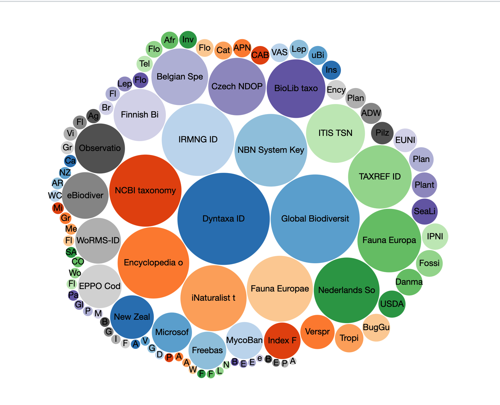
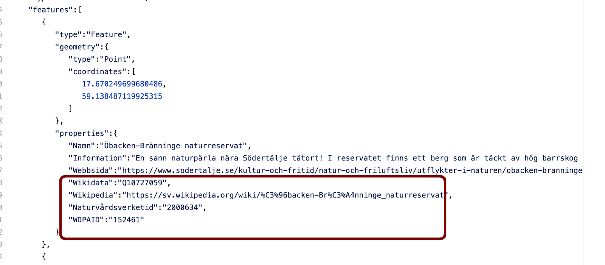

# Artportalen Wikidata
Tanken är att se hur vi kopplar ihop Artportalen med Wikidata

# Dyntaxa-ID Wikidata P1939
Finns en egenskap i Wikidata P1939 "ID i Svensk taxonomisk databas"
* [Kopplad 84 000 ggr](https://www.wikidata.org/wiki/Property_talk:P1939)
* [www.dyntaxa.se](https://www.dyntaxa.se/)
* Listor
  * egenskaper med P1939 [som har flest egenskaper i Wikidata](https://w.wiki/QzL) 
  * andra externa egenskaper [kopplade på samma objekt som Dyntaxa i WIkidata](https://w.wiki/QzN) som [bubblechart](https://w.wiki/QzQ)

# Länkar
* [artportalen.se About](https://artportalen.se/Home/About)
* [Förvaltningsledare vid SLU Artdatabanken](https://www.slu.se/installningar/personsok/?firstName=&lastName=Coulson&telephoneNumber=&email=&ou=&profile=&location=)
  * [Stephen Coulson medborgarforskning.se](https://medborgarforskning.se/2018/02/stephen-coulson/)
# Medborgarforskning i Sverige
* [medborgarforskning.se](https://medborgarforskning.se)
  * [Stephen Coulson medborgarforskning.se](https://medborgarforskning.se/2018/02/stephen-coulson/)
# iNaturalist
* [www.inaturalist.org](https://www.inaturalist.org/home)
* [hur en forskare utnyttjar medborgarforskning i Natutalist](https://forum.inaturalist.org/t/cool-new-paper-about-a-study-inspired-by-inat-observations/12351)
* [Wikipedia Weekly om kopplingar med iNaturalist](https://twitter.com/WikipediaWeekly/status/1258851809835102208?s=20)
* mina tankar om att [alla Naturreservat i Sverige borde finnas som ytor i iNaturalist](https://forum.inaturalist.org/t/creating-inaturalist-places-and-linking-to-wikidata-using-geojson/12220)
* [Wikidata:WikiProject iNaturalist](https://www.wikidata.org/wiki/Wikidata:WikiProject_iNaturalist) 
  * [Wikidata:WikiProject Taxonomy](https://www.wikidata.org/wiki/Wikidata:WikiProject_Taxonomy)
* [iNaturalist have reached 1000 000 observers](https://www.inaturalist.org/blog/35758-we-ve-reached-1-000-000-observers)
* [hur svenska Garnuddens naturreservat finns i iNaturalist](https://youtu.be/8u0orZtJWYY?t=4319) skapat via Naturvårdsverkets data
# Wikidata
* video [Vad är Wikidata](https://www.youtube.com/watch?v=m_9_23jXPoE)
  * [Föredrag jag höll om Wikidata på Länkade data i Sverige - webbinarium maj 2020](https://youtu.be/8u0orZtJWYY?t=3794)
* Wikidata egenskaper 
  * finns > [7000 egenskaper](http://w.wiki/DYS) 
  * finns > [5000 externa kopplingar](https://w.wiki/DYQ)
  * egenskaper som är [av typ taxa](https://w.wiki/Qz5) > 180 egenskaper
* Structured data on commons där vi kan i bilden ange person/art... i bild se [video Structured Data on Commons: We're making 50 million audiovisual pieces accessible in all languages](https://www.youtube.com/watch?v=lmWmMIuCJVM) anna [video där jag pratar om det](https://www.youtube.com/watch?v=8u0orZtJWYY&feature=youtu.be&t=4728)  

# Misc
* [Repository jag skapat om Open Data - Jupyter notebook](https://github.com/salgo60/open-data-examples)
* [blogpost om WDPA](http://minancestry.blogspot.com/2020/05/wdpa-property.html) i Wikidata
* Naturreservat
  * projekt Wikimedia Sverige gjort med Wikidata karta
  * [Garnuddens naturreservat](http://minancestry.blogspot.com/2020/05/adding-inaturalist-widget-to-page-for.html) som nu finns i iNaturalist skapat från Öppen data geojson från Naturvårdsverket
  * Naturreservat i Öppen data hos [Södertälje kommun men med fel](http://minancestry.blogspot.com/2020/05/blog-post.html) och önskan att dom skapar **samma som** Naturvårdsverket 

**inga samma som**
* tankar hur vi gör [Öppen data enklare att konsumer med Jupiter Nootebok](https://github.com/salgo60/open-data-examples)
* [Facebook fråga om Artportalen](https://www.facebook.com/groups/1462252750700734?post_id=2472887336303932&comment_id=2790787334513929&reply_comment_id=2791171431142186)

