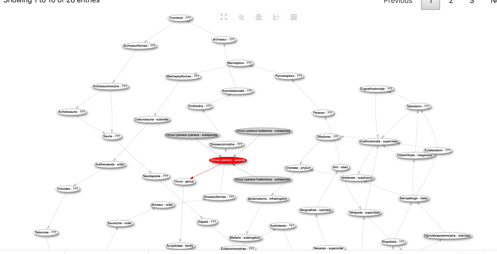
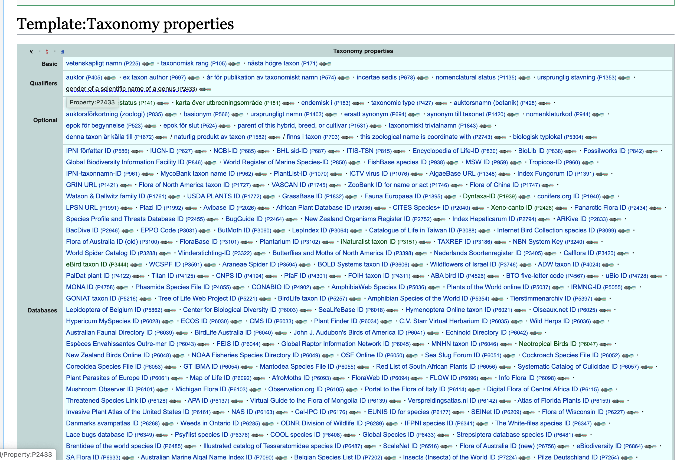

# Artportalen Wikidata
Tanken är att se hur vi kopplar ihop Artportalen med Wikidata
* [api-portal.artdatabanken.se](https://api-portal.artdatabanken.se/)

# Dyntaxa-ID Wikidata P1939
Finns en egenskap i Wikidata P1939 "ID i Svensk taxonomisk databas"
* [Kopplad 84 000 ggr](https://www.wikidata.org/wiki/Property_talk:P1939)
* [www.dyntaxa.se](https://www.dyntaxa.se/)
* Listor
  * egenskaper med P1939 [som har flest andra egenskaper i Wikidata](https://w.wiki/QzL) 
  * andra externa egenskaper [kopplade på samma objekt som Dyntaxa i WIkidata](https://w.wiki/QzN) som [bubblechart](https://w.wiki/QzQ)
  * saknar artikel i [sv:Wikipedia sorterade efter flest artiklar på andra språk](https://w.wiki/QzS)

## sv:Wikipedia
### mall Svalanrapporter länkar artdatabankens obsar
* [mall Svalanrapporter](https://sv.wikipedia.org/wiki/Mall:Svalanrapporter) borde inte denna mall kunna länka artportalen mha Dyntaxa-ID Wikidata P1939 --> kollar man på Art: Circus cyaneus - blå kärrhök
  * sv:Wikipedia [Blå kärrhök](https://sv.wikipedia.org/wiki/Blå_kärrhök)
  * Wikidata  [Q25572](https://www.wikidata.org/wiki/Q25572?uselang=sv)
  * Dynatax [taxon/info/100034](https://www.dyntaxa.se/taxon/info/100034) så vet den om 
    * Artfakta (ArtDatabanken)
    * Bilder (Artportalen)
    * Främmande arter (NOBANIS)
    * Svensk Kulturväxtdatabas (SKUD)
    * Naturforskaren (NRM)
    * Encyclopedia of Life
    * Biodiversity Heritage Library
    * PESI (europeisk taxonomi)
    * WoRMS (marin taxonomi)
    * Nordiska mikroalger (SMHI)
    * Wikipedia
    * Google 
    
Spontant borde det räcka att vi säger att vi kommer från Wikidata Q25572 och vill till Artportalen jmf
*  Dyntaxa-ID **100034** --> egenskap P1939  --> svenska Wikipedia artikeln för Blå kärrhök hittas med bara **100034** = 
   * sv:WIkipedia https://tools.wmflabs.org/hub/P1939:100034?lang=sv
   * en:Wikipedia https://tools.wmflabs.org/hub/P1939:100034
   * ru:WIkipedia https://tools.wmflabs.org/hub/P1939:100034?lang=ru
   * wildlife-species.canada.ca har egenskap P6019 --> https://tools.wmflabs.org/hub/P1939:100034?property=P6019
   * skulle det finnas vetenskapliga publikationer om Blå kärrhök så hittas dom med https://tools.wmflabs.org/hub/P1939:100034?site=scholia (verkar visa artspecifik info...Scholia [graf men svenska namn](https://tinyurl.com/testtaxa))

### Wikidata egenskaper Taxonomi

* länk [Taxonomy properties](https://www.wikidata.org/wiki/Template:Taxonomy_properties)
* [Wikidata:WikiProject_Taxonomy](https://www.wikidata.org/wiki/Wikidata:WikiProject_Taxonomy)

### sv:Wikipedia mall Taxonbar
* har idag en [mall Taxonbar](https://sv.wikipedia.org/wiki/Mall:Taxonbar) se [diskussionsida om hur den länkar](https://sv.wikipedia.org/wiki/Malldiskussion:Taxonbar#Byta_till_att_l%C3%A4nka_artfakta.se)
  * kanske den skulle kunna länka Svalan med P1939  "ID i Svensk taxonomisk databas"

## Exempel Länkröta dyntaxa Taxon <-> sv:Wikidata
* https://www.dyntaxa.se/Taxon/Info/1001459 links
  * Wikipedia https://sv.wikipedia.org/wiki/Circus - **fel länk** går till en Förgreningssida
    * bättre är länk [Kärrhökar](https://sv.wikipedia.org/wiki/K%C3%A4rrh%C3%B6kar)
    * variant är att lagra Wikidata Q207796 och länka svenska artikeln enligt
      * [Special:GoToLinkedPage/svwiki/Q207796](https://www.wikidata.org/wiki/Special%3AGoToLinkedPage/svwiki/Q207796)

# Länkar
* [artportalen.se About](https://artportalen.se/Home/About)
* [Förvaltningsledare vid SLU Artdatabanken](https://www.slu.se/installningar/personsok/?firstName=&lastName=Coulson&telephoneNumber=&email=&ou=&profile=&location=)
  * [Stephen Coulson medborgarforskning.se](https://medborgarforskning.se/2018/02/stephen-coulson/)

# Medborgarforskning i Sverige
* [medborgarforskning.se](https://medborgarforskning.se)
  * [Stephen Coulson medborgarforskning.se](https://medborgarforskning.se/2018/02/stephen-coulson/)

# iNaturalist
* [www.inaturalist.org](https://www.inaturalist.org/home)
* [hur en forskare utnyttjar medborgarforskning i Natutalist](https://forum.inaturalist.org/t/cool-new-paper-about-a-study-inspired-by-inat-observations/12351)
* [Wikipedia Weekly om kopplingar med iNaturalist](https://twitter.com/WikipediaWeekly/status/1258851809835102208?s=20)
* mina tankar om att [alla Naturreservat i Sverige borde finnas som ytor i iNaturalist](https://forum.inaturalist.org/t/creating-inaturalist-places-and-linking-to-wikidata-using-geojson/12220)
* [Wikidata:WikiProject iNaturalist](https://www.wikidata.org/wiki/Wikidata:WikiProject_iNaturalist) 
  * [Wikidata:WikiProject Taxonomy](https://www.wikidata.org/wiki/Wikidata:WikiProject_Taxonomy)
* [iNaturalist have reached 1000 000 observers](https://www.inaturalist.org/blog/35758-we-ve-reached-1-000-000-observers)
* [hur svenska Garnuddens naturreservat finns i iNaturalist](https://youtu.be/8u0orZtJWYY?t=4319) skapat via Naturvårdsverkets data
# Wikidata
* video [Vad är Wikidata](https://www.youtube.com/watch?v=m_9_23jXPoE)
  * [Föredrag jag höll om Wikidata på Länkade data i Sverige - webbinarium maj 2020](https://youtu.be/8u0orZtJWYY?t=3794)
    * [repository](https://github.com/salgo60/Wikidata-2020---Linked-data-Sweden)
* Wikidata egenskaper 
  * finns > [7000 egenskaper](http://w.wiki/DYS) 
  * finns > [5000 externa kopplingar](https://w.wiki/DYQ)
  * egenskaper som är [av typ taxa](https://w.wiki/Qz5) > 180 egenskaper
* Structured data on commons där vi kan i bilden ange person/art... i bild se [video Structured Data on Commons: We're making 50 million audiovisual pieces accessible in all languages](https://www.youtube.com/watch?v=lmWmMIuCJVM) annan [video där jag pratar om det](https://www.youtube.com/watch?v=8u0orZtJWYY&feature=youtu.be&t=4728)  
   * nedan bild som visar hur det blir konceptuellt att objekt kopplas till olika delar av bilden och namnet kan visas på olika språk (> 300 språk i Wikidata, lyssna på hur länkade data är magiskt att stödja flera språk [SWIB18 talk by Karen Smith-Yoshimura](https://youtu.be/K0l4fv5uUvg?t=1961)) 

# Misc
* [Repository jag skapat om Open Data - Jupyter notebook](https://github.com/salgo60/open-data-examples)
* [blogpost om WDPA](http://minancestry.blogspot.com/2020/05/wdpa-property.html) i Wikidata
* Naturreservat
  * projekt [Wikipedia:Projekt_naturreservat](https://sv.wikipedia.org/wiki/Wikipedia:Projekt_naturreservat) 
  * Wikimedia Sverige skapade en [karta länk](https://wle2020.kodapan.se/) med fri geojson från Naturvårdsverket [wmse-wiki-loves-2020](https://phabricator.wikimedia.org/tag/wmse-wiki-loves-2020/) plus sparade det i [Wikicommons](https://commons.wikimedia.org/wiki/Data:/Sweden/Nature_reserves/2020/Garnudden/2021789.map)
  * [Garnuddens naturreservat](http://minancestry.blogspot.com/2020/05/adding-inaturalist-widget-to-page-for.html) som nu finns i iNaturalist skapat från Öppen data geojson från Naturvårdsverket
  * Naturreservat i Öppen data hos [Södertälje kommun men med fel](http://minancestry.blogspot.com/2020/05/blog-post.html) och önskan att dom skapar **samma som** Naturvårdsverket 

* tankar hur vi gör [Öppen data enklare att konsumer med Jupiter Nootebok](https://github.com/salgo60/open-data-examples)
* [Facebook fråga om Artportalen](https://www.facebook.com/groups/1462252750700734?post_id=2472887336303932&comment_id=2790787334513929&reply_comment_id=2791171431142186)

